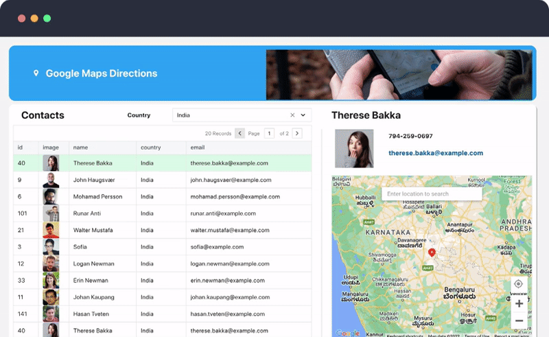
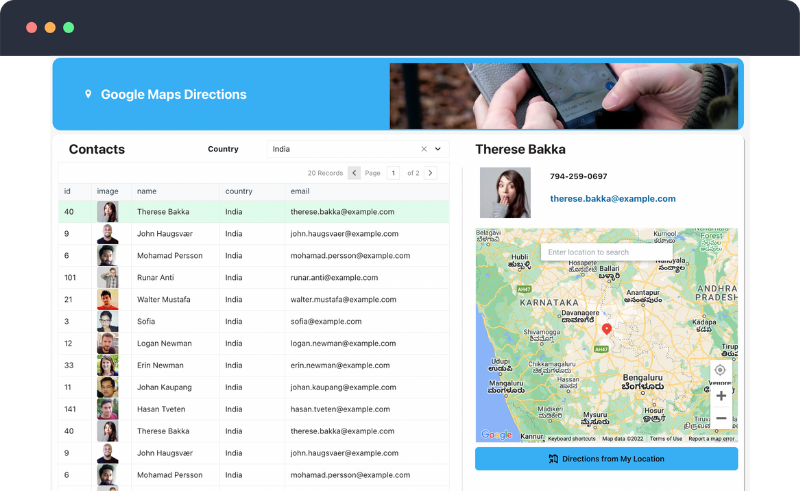

# [Google Maps Navigation](https://www.appsmith.com/template/google-maps-navigation)

# Overview
### Supporting a team of delivery drivers or techs working in the field can be challenging. Often times, there is a dispatcher or office admin that can help organize their travel plans and keep everyone updated. 

### This app uses Google Maps to generate driving directions based on your team's location so dispatchers and office admins can quickly send navigation links to their team. 

# Highlights of the app
- Users can select different team members to view their location on a map
- Users can generate driving directions from their current location to the selected team member
- Users can add a new map pin, and generate driving directions from the team member to a custom location

|Template URL|https://app.appsmith.com/templates/62bc9089e8e73110ce2527f9|
|---|---|
|**Datasources**|REST API|
|**Widgets**|Map, Table, Button, Select, Image|
|**Function**|Support|
|**minVersion**|v1.7.1-SNAPSHOT|
|**Last Updated**||

