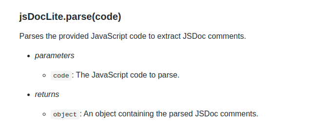

# jsDocLite



This module provides functionality to parse JSDoc comments from JavaScript code.

## Usage

You can use the JSDelivr CDN to import this custom library into Appsmith.
```sh
https://cdn.jsdelivr.net/gh/appsmithorg/forge@main/dist/jsDocLite.umd.js
```

## Methods

- [parseFromUrl](#jsdocliteparsefromurlurl) 
- [parse](#jsdocliteparsecode) 
- [parseComment](#jsdocliteparsecommentcomment) 
- [cleanCommentBlock](#jsdoclitecleancommentblockcommentblock) 
- [fetchJsContent](#jsdoclitefetchjscontenturl) 
-----
### jsDocLite.parseFromUrl(url)

Asynchronously fetches JavaScript content from a URL and parses the JSDoc comments.

- *parameters*
  - `url`: The URL to fetch the JavaScript content from. 

- *returns*

  - `Promise<object>`: An object containing the parsed JSDoc comments.

- *async*


-----
### jsDocLite.parse(code)

Parses the provided JavaScript code to extract JSDoc comments.

- *parameters*
  - `code`: The JavaScript code to parse. 

- *returns*

  - `object`: An object containing the parsed JSDoc comments.


-----
### jsDocLite.parseComment(comment)

Parses a single JSDoc comment block to extract information.

- *parameters*
  - `comment`: The JSDoc comment block to parse. 

- *returns*

  - `object|null`: An object containing the parsed information from the JSDoc comment, or null if no recognized entry tag is found.


-----
### jsDocLite.cleanCommentBlock(commentBlock)

@function cleanCommentBlock Cleans a JSDoc comment block by removing the commenting marks from each line.

- *parameters*
  - `commentBlock`: The JSDoc comment block to clean. 

- *returns*

  - `string`: The cleaned comment block.


-----
### jsDocLite.fetchJsContent(url)

Asynchronously fetches JavaScript content from a URL.

- *parameters*
  - `url`: The URL to fetch the JavaScript content from. 

- *returns*

  - `Promise<string>`: A promise that resolves with the fetched JavaScript content as text.

- *async*


-----
 ## Constants

### entryRegex

An object of regex to help identify entries for documentation (functions, constants, and modules).

### tagRegex

An object of regex to help identify tags for identified entries.

### jsdocRegex

Regex to help identify JS Doc blocks in code.

## Contributing

Contributions are always welcome!

## License

[MIT](https://choosealicense.com/licenses/mit/)
