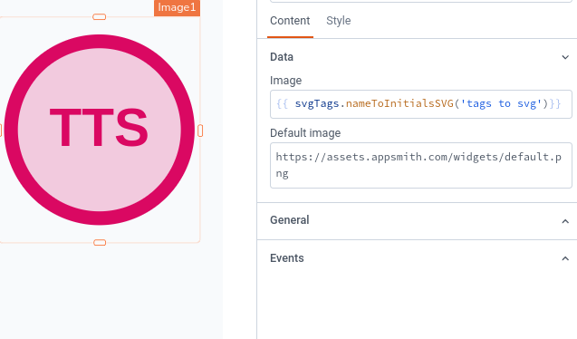

# svgTags



@module svgTags Provides methods to generate SVG based tags for content and object.

## Usage

You can use the JSDelivr CDN to import this custom library into Appsmith.
```sh
https://cdn.jsdelivr.net/gh/appsmithorg/forge@main/dist/svgTags.umd.js
```

## Methods

- [stringToNum](#svgtagsstringtonuminputstringmodsize) 
- [listToTags](#svgtagslisttotagsinputstring) 
- [nameToInitialsSVG](#svgtagsnametoinitialssvgstr) 
- [selectOptions](#svgtagsselectoptionsdatalabelvalue) 
- [objToRows](#svgtagsobjtorowsobj) 
-----
### svgTags.stringToNum(inputString,modSize)

@method stringToNum Convert a string into a repeatable numeric value in a range from 0 to modSize.

- *parameters*
  - `inputString`: The input string to be converted. 
  - `modSize`: The modulo value (must be greater than 0). Set to 1 + max desired return value. 

- *returns*

  - `number`: The numeric representation of the input string.


-----
### svgTags.listToTags(inputString)

@method listToTags Create colored tags based on the input string of comma separated values.

- *parameters*
  - `inputString`: The input string to create colored tags from. 

- *returns*

  - `string`: HTML representation of colored elements.


-----
### svgTags.nameToInitialsSVG(str)

@method nameToInitialsSVG Create an SVG representation of colored initials from the input string and return it as a Data URI.

- *parameters*
  - `str`: The input string to generate initials from. 

- *returns*

  - `string`: Data URI of the generated SVG.


-----
### svgTags.selectOptions(data,label,value)

@method selectOptions Generates array of {label, value} objects sorted by label & with unique values, for use in Select or List widgets. 
 Supports nested paths, and filters out options where the label or value are null or undefined.

- *parameters*
  - `data`: An array of objects, from your API or Query response. 
  - `label`: A property name, or valid json path. 
  - `value`: A property name, or valid json path. 

- *returns*

  - `array`: - [{label, value},...] or empty array if path is invalid.


-----
### svgTags.objToRows(obj)

@method objToRows Converts a single object to an array of {property, value} objects, 
 for viewing a single row vertically in Select or List widgets.

- *parameters*
  - `obj`: A single row of data from an API, Query, or selected table/list row. 

- *returns*

  - `array`: - [{property, value},...] or empty array if obj us invalid.


-----
 ## Constants

### colors

@const {array} colors Array of colors for use with various SVG generators.

## Contributing

Contributions are always welcome!

## License

[MIT](https://choosealicense.com/licenses/mit/)
