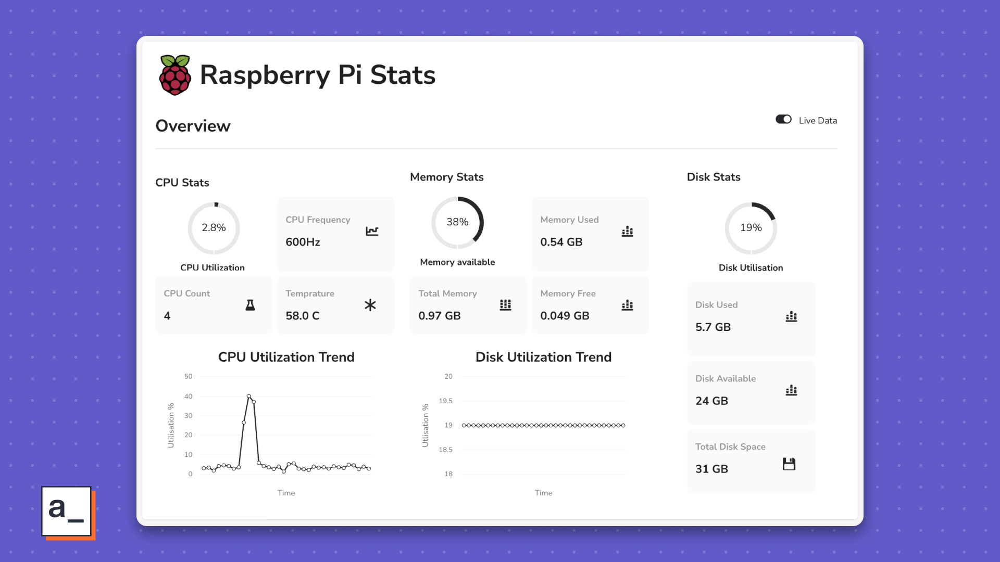

# Build a Raspberry Pi monitoring dashboard in under 30 minutes

> The dashboard shows CPU, disk, and memory stats without additional hardware and 17/10 dev skills.

This app export goes along with a tutorial that walks you through building an on-demand Raspberry Pi monitoring dashboard fast to see CPU, memory, and disk stats in real-time and add more views + actions over time just as easily.

